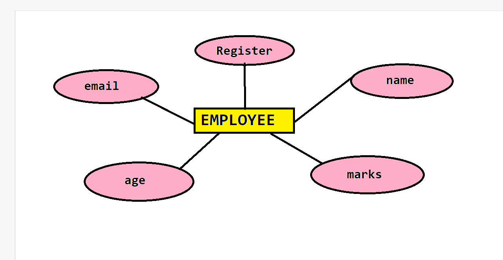
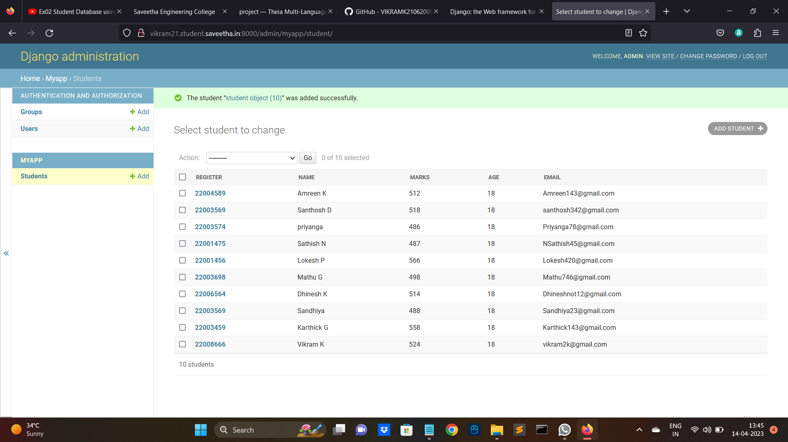

# Ex02 Django ORM Web Application

## AIM
To develop a Django application to store and retrieve data from a student database using Object Relational Mapping(ORM).

## Entity Relationship Diagram



## DESIGN STEPS

### STEP 1:
clone the repository from github.

### STEP 2:
Create an admin interface for Django.

### STEP 3:
Create an app edit settings.py

### STEP 4:
Makemigration and Migrate the changes.

### STEP 5:
Create addmin user and write Python code for admin and models.

### STEP 6:
Make all the migrations to 'myapp'

### STEP 7:
Create an student database with 10 fields using runserver command.
## PROGRAM

```
admin.py

from django.contrib import admin
from.models import student,studentAdmin
admin.site.register(student,studentAdmin)

models.py

from django.db import models
from django.contrib import admin
class student (models.Model):
    register=models.IntegerField()
    name=models.CharField(max_length=100)
    marks=models.IntegerField()
    age=models.IntegerField()
    email=models.EmailField()

class studentAdmin(admin.ModelAdmin):
    list_display=('register','name','marks','age','email')
```

## OUTPUT




## RESULT
The program for creating an employee database using ORM is executed successfully